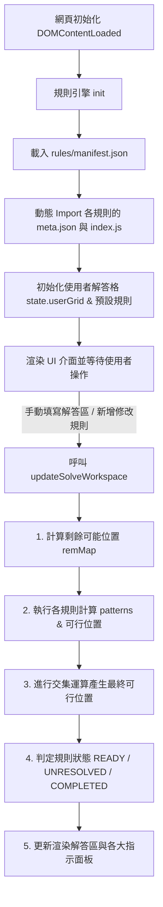

# Zebra Riddle 斑馬難題視覺化推理助手

本專案是一個基於 HTML 與 JavaScript（ES Module）建構的互動式 **斑馬難題（Zebra Riddle）** 推理輔助工具。

有別於一般的「直接暴力破解器」，本專案旨在提供一個**直觀且富有美感的視覺化工作區**，透過實時的邏輯計算與狀態分析，輔助使用者一步步親自推理並解決謎題，享受邏輯解謎的樂趣。同時，專案內建了**模組化的規則引擎**，方便開發者隨時新增或修改限制條件規則。

---

## 1. 專案簡要描述

**斑馬難題（Zebra Riddle）**，又稱愛因斯坦謎題（Einstein's Riddle），是一種經典的邏輯推理遊戲。其基本結構如下：
- **個體與位置**：有 $N$ 個個體（通常是 5 間房子或 5 個不同國籍的人）由左至右排成一列（位置編號 $1$ 至 $N$）。
- **特徵與可能值**：每個個體擁有 $M$ 個特徵類別（如：國籍、衣服顏色、飲料、寵物、香菸牌子等）。每個類別皆有 $N$ 個不重複的特徵值。
- **限制條件**：題目會提供若干條限制條件（例如：「挪威人住第一間房子」、「綠房子在白房子的左側隔壁」）。除此之外，不同個體間在同一個特徵類別上，會有不同的特徵值。

本專案提供以下三個核心面板，供使用者管理謎題與進行推理：
1. **個體特徵設定**：自定義謎題規模（個體數量與特徵類別及其值）。
2. **規則選擇與設定**：動態新增、編輯、啟用或停用限制條件，並透過**規則引擎**自動生成描述與計算可行位置。
3. **推理互動工作區**：玩家透過填寫「解答區」並配合系統計算的「剩餘可能位置」與「規則交集可行位置」進行雙向推導，亦可使用「自動推理」按鈕快速排除確定項。

---

## 2. 程式運行邏輯與流程

本專案的核心由 [app.js](app.js) 主控，並引入 [ruleEngine.js](ruleEngine.js) 作為規則處理核心。其運作邏輯如下：



### 詳細核心邏輯說明：
1. **初始化階段**：
   - 載入 `rules/manifest.json`，對其中註冊的每個規則資料夾，動態載入其配置（`meta.json`）與 ES Module 代碼（`index.js`），存入規則引擎。
   - 依據規則引擎載入的模組，動態生成「新增限制條件」的輸入表單。

2. **實時推理計算流程 (`updateSolveWorkspace`)**：
   - **Step 1: 計算剩餘可能位置 (`remMap`)**：根據解答區已被佔用的格子，算出每個特徵值目前剩餘的位置。例如：若「挪威人」已確定在位置 1，則挪威人的剩餘位置僅有 `[1]`；其他國籍的剩餘位置則會排除 `1`。
   - **Step 2: 獨立規則排除**：將 `remMap` 丟給各條「已啟用」的規則，各規則各自調用 `calculateFeasiblePositions`，計算出在滿足該單一限制條件下，所涉及特徵值的可能位置。
   - **Step 3: 最終交集運算 (`computeFinalFeasiblePositions`)**：將所有規則計算出來的可行位置與原本的 `remMap` 進行**交集 (Intersection)**。若某特徵值在所有規則交集後只剩一個可行位置，該位置即為該特徵值的確定位置。
   - **Step 4: 狀態分級與排序**：系統分析各規則狀態並排序渲染：
     - **READY（可填入）**：本規則已能將涉及的特徵值限縮至唯一位置，但使用者尚未在「解答區」填入。
     - **UNRESOLVED（未解決）**：本規則涉及的特徵值仍有複數個可能的位置。
     - **COMPLETED（已反映）**：本規則已分析出唯一位置，且解答區已完成該值的填寫。

---

## 3. 用戶介面與互動指南

本系統包含三個主要分頁，使用者可以點擊頁簽進行切換：

### 📌 頁頭工具列：題目匯入與匯出
- **匯出題目** / **匯出題目與解答**：將當前的個體規模、特徵設定、所有規則（包含啟用狀態）以及解答區內容匯出為 `.json` 檔案。
- **匯入題目** / **匯入題目與解答**：上傳已匯出的 JSON 檔案，快速還原題目或推理進度。

---

### 1️⃣ 個體特徵設定 頁簽
本頁簽用以定義謎題的規模與內容：
- **修改個體數量 (N 個位置)**：點擊「個體數量」旁的 **`+`** 或 **`-`** 按鈕（範圍：2 ~ 8）。調整此值時，系統會自動在下方各特徵類別中同步增加或減少預設值，並重置解答區。
- **新增特徵類別**：點擊「新增特徵類別」按鈕。系統會新增一個卡片，並自動填入 $N$ 個預設值。
- **刪除特徵類別**：在要刪除的特徵卡片右上角點擊「**刪除此類別**」按鈕（系統強制至少保留一個類別）。
- **修改特徵名稱與可能值**：直接在「特徵類別」輸入框修改類別名稱（例如：將「特徵1」改為「飲料」），並在下方的格子中修改各個特徵的可能值（每個類別內的值請保持唯一，不可重複）。

---

### 2️⃣ 規則選擇與設定 頁簽
本頁簽用於建立與管理謎題的限制條件：
- **新增規則**：
  1. 在「**1. 選擇限制條件類型**」下拉選單中選擇需要的規則（例如：確定相同、相鄰、確定順序等）。
  2. 選擇後，下方的輸入區會動態出現對應的參數下拉選單。
  3. 選擇要套用的特徵值、位置或方向後，點擊「**加入限制條件列表**」按鈕。
- **啟用 / 停用規則**：在右側規則清單中，勾選或取消勾選每條規則左側的核取方塊。停用的規則不會參與推理計算。
- **刪除規則**：點擊規則右側的紅色「垃圾桶」按鈕。
- **批次操作**：可點擊清單上方的「**全部啟用**」、「**全部不啟用**」或「**全部刪除**」快速整理規則。

---

### 3️⃣ 推理互動工作區 頁簽
此區是推理的主戰場，分成四大區塊：
- **解答區**（左上）：玩家填寫最終答案的表格。
  - 點擊下拉選單，可以選擇該位置對應的特徵值。
  - 已選取的特徵值會以黃色高亮顯示。
  - 每一行（類別）已被選過的值，在該行的其他位置下拉選單中會自動顯示為 `disabled`，避免重複選取。
  - 點擊「**重置**」按鈕可清空所有解答選項。
- **特徵值剩餘位置區 (基於解答區推導)**（中上）：顯示依據解答區現狀，各特徵值還能放在哪些位置。
- **特徵值可行位置區 (規則綜合交集)**（右上）：顯示經過所有「已啟用規則」進行排他性與交集計算後，各特徵值最終合法的位置。
  - **綠色 badge (單一數字)**：代表此值可行位置唯一，此即為正確答案！
  - **藍色 badge (多個數字)**：代表尚有多個可能位置。
  - **紅色 badge (空值/無解)**：代表推理發生衝突，請檢查規則是否矛盾。
- **規則展示與特徵可行位置推理分析區**（下方）：
  - 每一行展示一條啟用規則的詳細推理過程。
  - 「**可能的排列方式**」欄位會拆解出此規則的所有可能排法（如 `A | B`），並計算出在此排法下各自的可行位置。
  - 系統會自動對規則進行**狀態分類與排序**：
    - **READY (黃色高亮)**：此規則已經為其特徵值推導出唯一可行位置，但您尚未在解答區中填入。**這是系統給您的下一步提示！**
    - **UNRESOLVED (藍色)**：仍在推理中，尚未有唯一解。
    - **COMPLETED (灰色半透明)**：此規則的答案已填入解答區。
- **🤖 使用輔助推理 (自動推理)**：
  - 點擊解答區右上角的「**自動推理**」按鈕。
  - 系統會掃描「特徵值可行位置區」，將所有「可行位置僅剩一個且尚未填入解答區」的特徵值自動填入解答區。
  - 此過程會反覆遞迴執行，直到再也沒有確定項，或解答已全部填滿為止。

---

## 4. 規則引擎架構與自訂規則指南

本專案採用高度解耦的**外掛式 (Plugin) 規則引擎**。所有的限制條件皆以獨立的資料夾模組存在於 `rules/` 目錄中。

### 📁 規則目錄結構
要新增一項規則類型，只需在 `rules/` 資料夾下建立一個新的子資料夾（例如 `rules/rule-my-custom`），並包含以下兩個檔案：

```
rules/
  ├── manifest.json                  # 註冊所有規則模組的清單
  └── rule-my-custom/
        ├── meta.json                # 規則的元數據與 UI 輸入表單宣告
        └── index.js                 # 規則的邏輯與可行位置計算
```

並在 [rules/manifest.json](rules/manifest.json) 中加入該資料夾名稱：
```json
{
  "rules": [
    "rule-exact-position",
    "rule-my-custom"
  ]
}
```

---

### 📝 1. `meta.json` 格式規範
此檔案定義規則的代號、在下拉選單顯示的名稱，以及在 UI 新增規則時需要呈現的輸入欄位。

```json
{
  "type": "MY_CUSTOM_RULE",
  "name": "自訂規則中文名稱 (例如：A 在 B 的某處)",
  "inputs": [
    {
      "key": "val1",
      "label": "特徵值 A",
      "type": "VALUE_SELECT"
    },
    {
      "key": "offset",
      "label": "偏移位置",
      "type": "POS_SELECT"
    }
  ]
}
```


#### `inputs` 欄位類型說明：
- `"type": "VALUE_SELECT"`：UI 會渲染成一個包含當前所有特徵值（例如「挪威人」、「紅房子」）的下拉選單。
- `"type": "POS_SELECT"`：UI 會渲染成一個位置選單（$1$ 至 $N$）。
- `"type": "DIR_SELECT"`：UI 會渲染成左側/右側方向選單（值為 `"left"` 或 `"right"`）。
- `"type": "NUM_SELECT"`：UI 會根據設定的範圍（`min` 至 `max`）生成數字選單，並支援傳入文字模板（`pattern`）或自訂顯示名稱陣列（`texts`）。
- `"type": "CUSTOM_SELECT"`：完全自訂選單。支援透過 `options` 傳入自訂選項陣列（靜態或動態產生），或透過 `render` 函式實現極限自訂（如 `<optgroup>` 分組）。

---

##### `NUM_SELECT` 使用範例

1. **基本數字範圍**（預設為 1 到 5）：
   ```javascript
   {
     type: "NUM_SELECT",
     min: 1,
     max: 5
   }
   ```

2. **使用文字模板 (`pattern`)**：
使用 `${i}` 作為數字佔位符，自訂選單顯示格式：
   ```javascript
   {
     type: "NUM_SELECT",
     min: 1,
     max: 3,
     pattern: "第 ${i} 間" // 選項顯示：第 1 間、第 2 間、第 3 間
   }
   ```


3. **使用自訂顯示名稱 (`texts`)**：
傳入陣列以替換特定數字對應的顯示文字：
   ```javascript
   {
     type: "NUM_SELECT",
     min: 1,
     max: 3,
     texts: ["一樓", "二樓", "三樓"] // 選項顯示：一樓、二樓、三樓
   }
   ```

---

##### `CUSTOM_SELECT` 使用範例與說明

`CUSTOM_SELECT` 支援以下幾種設定方式：

1. **靜態選項陣列 (`options`)**
   適合選項數量固定，但值與顯示文字不同的情境：

   ```javascript
   {
     type: "CUSTOM_SELECT",
     options: [
       { value: "red", label: "紅色 🔴" },
       { value: "green", label: "綠色 🟢" },
       { value: "blue", label: "藍色 🔵", disabled: true }
     ]
   }
   ```

2. **簡易字串陣列 (`options`)**
若 `value` 與顯示文字相同，可直接傳入純字串陣列：
    
   ```javascript
   {
     type: "CUSTOM_SELECT",
     options: ["選項 A", "選項 B", "選項 C"]
   }
   ```

3. **動態產生選項 (`options` 函式)**
若選項需依據當前系統狀態（`state`）或全域資料（`allValues`）計算，可傳入函式：
    
   ```javascript
   {
     type: "CUSTOM_SELECT",
     options: ({ state, allValues }) => {
       return state.isAdvancedMode
         ? [{ value: "hard", label: "高難度模式" }, { value: "expert", label: "專家模式" }]
         : [{ value: "easy", label: "簡單模式" }];
     }
   }
   ```


4. **極限自訂渲染 (`render` 函式)**
需要 DOM 完全主導權時（例如加入 `<optgroup>` 分組、清空原有內容或注入自訂 HTML）：

   ```javascript
   {
     type: "CUSTOM_SELECT",
     render: (inputElem, { input, state, allValues }) => {
       inputElem.innerHTML = `
         <optgroup label="分類 A">
             <option value="a1">選項 A-1</option>
         </optgroup>
         <optgroup label="分類 B">
             <option value="b1">選項 B-1</option>
         </optgroup>
       `;
     }
   }
   ```


---

### ⚙️ 2. `index.js` 介面規範
該檔案必須以 `export default` 導出一個物件，其中包含以下四個介面函數：

#### ① `buildDescription(params)`
- **用途**：組合規則的參數，輸出給 UI 呈現的中文簡要描述。
- **輸入**：`params` (Object) - Key-Value 結構，對應 `meta.json` 中配置的 `inputs.key` 及其選擇的值。
- **輸出**：`string` - 規則描述字串。
- **範例**：
  ```javascript
  buildDescription(params) {
    return `${params.val1} 位於第 ${params.pos} 個位置`;
  }
  ```

#### ② `getInvolvedValues(params)`
- **用途**：宣告此規則所涉及的特徵值，用於引擎後續將計算結果合併交集。
- **輸入**：`params` (Object)
- **輸出**：`Array<string>` - 涉及的特徵值陣列。
- **範例**：
  ```javascript
  getInvolvedValues(params) {
    return [params.val1, params.val2];
  }
  ```

#### ③ `getPatterns(params, remMap, N)`
- **用途**：將規則拆解為所有可能的匹配模式，並列出各模式下，所涉及的特徵值各自之可行位置。這會直接渲染在「推理分析區」的中間欄位。
- **輸入**：
  - `params` (Object) - 規則設定參數。
  - `remMap` (Object) - 目前各特徵值剩餘可能位置的 Map。例如 `{"挪威人": [1], "紅房子": [2,3,4]}`。
  - `N` (number) - 當前個體數量。
- **輸出**：`Array<Object>` - 模式陣列，每個模式物件格式如下：
  ```javascript
  [
    {
      expr: "模式表示法 (例如: A = B 或 A | B)",
      keys: [val1, val2], // [選填] 特徵值的原始宣告順序，防止 JS 對數字 key 進行自動排序
      feasMap: {
        [val1]: [1, 2], // 該模式下 val1 的可行位置
        [val2]: [2, 3]  // 該模式下 val2 的可行位置
      }
    }
  ]
  ```

#### ④ `calculateFeasiblePositions(params, remMap, N)`
- **用途**：計算在滿足此規則的所有可能模式下，所涉及的特徵值最終各自可行的位置。
- **核心邏輯**：由於只要在其中一種模式下成立即可，因此該函數的輸出通常是 `getPatterns` 中所有模式可行位置的**聯集（Union）**。
- **輸入**：同 `getPatterns`。
- **輸出**：`Object` - 格式為 `{ [val]: Array<number> }`。
- **範例**：
  ```javascript
  calculateFeasiblePositions(params, remMap, N) {
    const patterns = this.getPatterns(params, remMap, N);
    const result = { [params.val1]: new Set(), [params.val2]: new Set() };
    
    // 合併所有模式的可行位置 (聯集)
    patterns.forEach(p => {
      Object.keys(p.feasMap).forEach(v => {
        p.feasMap[v].forEach(pos => result[v].add(pos));
      });
    });
    
    return {
      [params.val1]: Array.from(result[params.val1]).sort((a, b) => a - b),
      [params.val2]: Array.from(result[params.val2]).sort((a, b) => a - b)
    };
  }
  ```

---

### 💡 範例：確定相同規則 (`rule-same-entity`) 完整實作

#### `meta.json`
```json
{
  "type": "SAME_ENTITY",
  "name": "確定相同 (A 就是 B，同一個體)",
  "inputs": [
    { "key": "val1", "label": "特徵值 A", "type": "VALUE_SELECT" },
    { "key": "val2", "label": "特徵值 B", "type": "VALUE_SELECT" }
  ]
}
```

#### `index.js`
```javascript
export default {
  buildDescription(params) {
    return `${params.val1} 與 ${params.val2} 是同一個體`;
  },

  getInvolvedValues(params) {
    return [params.val1, params.val2];
  },

  getPatterns(params, remMap, N) {
    const remA = remMap[params.val1] || [];
    const remB = remMap[params.val2] || [];
    // 既然是同一個體，可行位置必須是 A 與 B 剩餘可能位置的交集
    const common = remA.filter((p) => remB.includes(p));

    return [
      {
        expr: `${params.val1} = ${params.val2}`,
        keys: [params.val1, params.val2],
        feasMap: { 
          [params.val1]: common, 
          [params.val2]: common 
        },
      }
    ];
  },

  calculateFeasiblePositions(params, remMap, N) {
    const patterns = this.getPatterns(params, remMap, N);
    return patterns[0].feasMap;
  },
};
```
